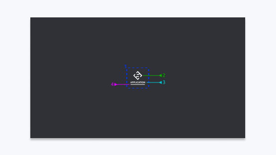

# Splash screen

The spash screen component is used when an application is launching.

## Examine

_Standard view - The user can expect to see this upon launching the application._

1. **Content**
   - Aligned in the middle of the viewport
2. **Application icon**
   - Prefer size of `80px x 80px`
   - Prefer single colour
   - Default to the Smiosoft logo when there isn't a dedicated icon for the application
3. **Application name**
   - Bold and upper-case
4. **Loader**
   - Simple animated line to indicate a process is being carried out and the user should wait
