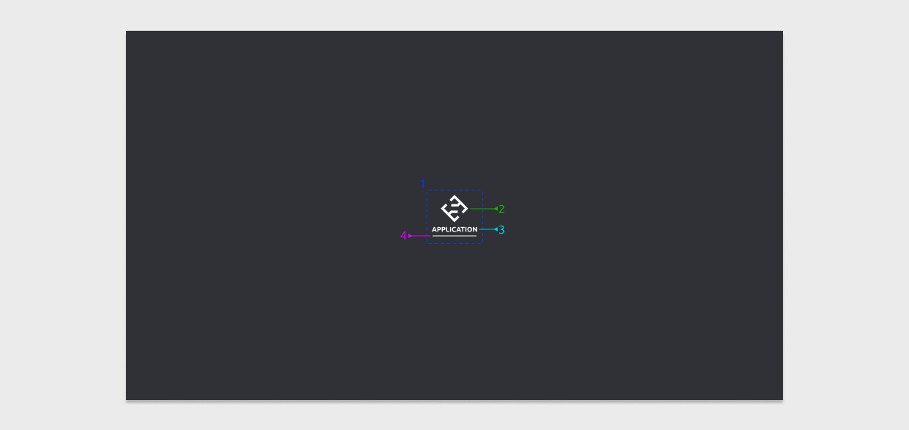

# Splash screen

The spash screen component is used when an application is launching.

## Examine

1. **Content** is aligned in the middle of the viewport
2. **Application logo**, or smiosoft logo as a default/fallback
3. **Application name** in bold and capital letters
4. **Loader**, a simple animated line to indicate a process is being carried out and the user should wait
