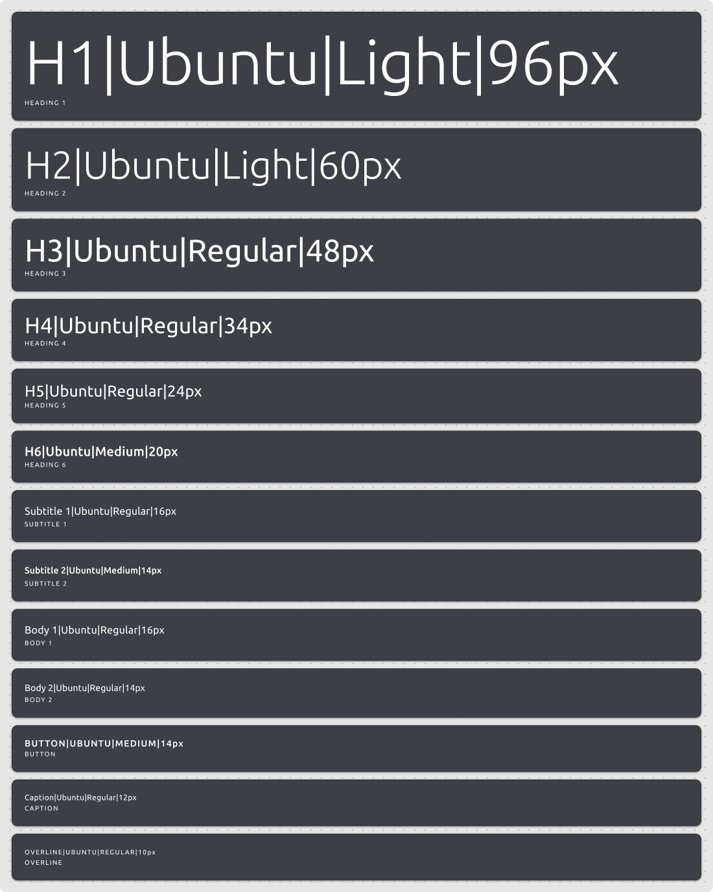

# Typography

_A mostly reasonable approach to typography usages and styling._

1. [Typeface](#typeface)
1. [Styles](#styles)

## Typface

### _Prefer [Ubuntu](https://fonts.google.com/specimen/Ubuntu)_

## Styles

